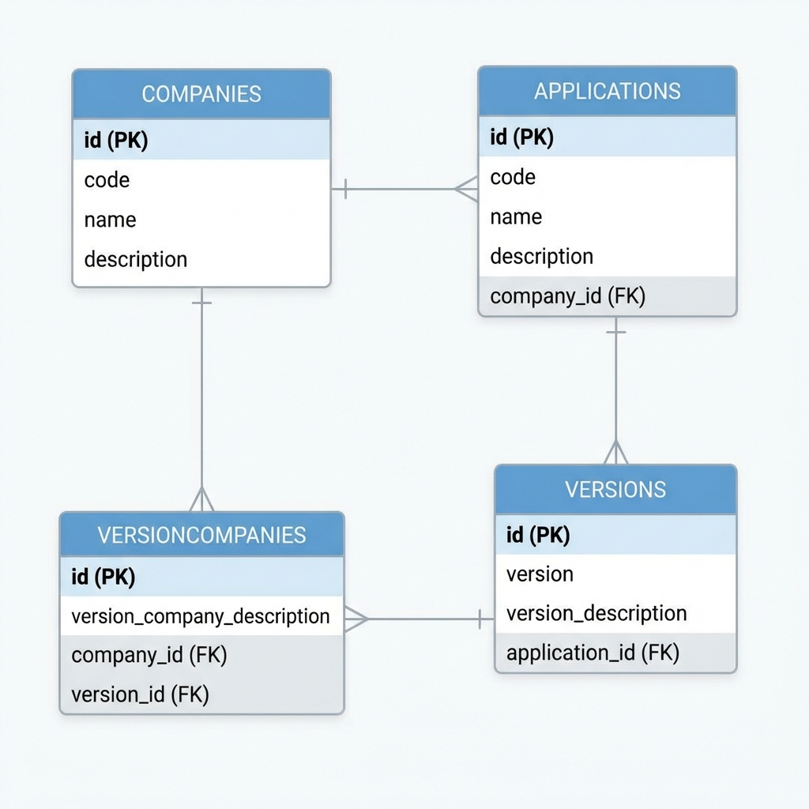

# Prueba Técnica Ada

Este proyecto es una aplicación full-stack que consiste en un backend Spring Boot y un frontend Angular.

## Tecnologías Utilizadas

- **Backend**: Spring Boot 3.2.0, Java 17, Spring Data JPA, H2 Database (In-Memory).
- **Frontend**: Angular 18+, Material Design.
- **Documentación**: SpringDoc OpenAPI (Swagger).
- **Herramientas**: Maven, NPM.

## Estructura del Proyecto

- `api/`: Código fuente del backend (Spring Boot).
- `client/`: Código fuente del frontend (Angular).

## Requisitos Previos

- Java 17 o superior.
- Node.js y NPM.
- Maven.

## Cómo Ejecutar el Proyecto

### Backend (API)

1. Navega a la carpeta `api`:
   ```bash
   cd api
   ```
2. Ejecuta el proyecto con Maven:
   ```bash
   mvn spring-boot:run
   ```
3. La API estará disponible en `http://localhost:8080`.
4. El Swagger UI se puede acceder en: `http://localhost:8080/swagger-ui/index.html`.
5. La consola de H2 está disponible en `http://localhost:8080/h2-console` (JDBC URL: `jdbc:h2:mem:testdb`).

### Frontend (Client)

1. Navega a la carpeta `client`:
   ```bash
   cd client
   ```
2. Instala las dependencias:
   ```bash
   npm install
   ```
3. Ejecuta el servidor de desarrollo:
   ```bash
   npm start
   ```
4. El frontend estará disponible en `http://localhost:4200`.

## Documentación de la API

La API sigue los principios REST y utiliza OpenAPI 3.0 para la documentación.

- [Documentación Detallada (Markdown)](api/API-DOCS.md)
- [Swagger UI (Interactivo)](http://localhost:8080/swagger-ui/index.html) (Requiere la aplicación en ejecución)

Puedes explorar y probar los endpoints directamente desde el Swagger UI una vez que el backend esté en ejecución.

## Entidades Principales

- **Company**: Representa una empresa.
- **Application**: Representa una aplicación de software.
- **Version**: Representa una versión específica de una aplicación.
- **VersionCompany**: Gestiona la relación entre versiones de aplicaciones y empresas.

## Esquema de Base de Datos

A continuación se muestra el diagrama de entidad-relación (ERD) que detalla las tablas y sus relaciones:



## Generación de Nombres de Compañía

Para el poblamiento inicial de datos (`DataInitializer`), se implementó un algoritmo de generación de nombres aleatorios diseñado para simular nombres de empresas coherentes.

### Construcción del Algoritmo

1.  **Arreglo de Caracteres**: Se utiliza un conjunto predefinido de letras (como `w, e, r, f, b, ...`) extraídas de una cadena base, eliminando espacios en blanco para asegurar una selección de caracteres válida.
2.  **Selección Aleatoria**: Se genera una cadena de longitud variable (entre 5 y 10 caracteres) seleccionando posiciones al azar dentro del arreglo de caracteres.
3.  **Estandarización vía Expresiones Regulares**:
    Para garantizar que los nombres generados tengan un formato profesional, se aplica la siguiente expresión regular:
    `^([a-z])(.*)$`
    
    *   **Funcionamiento**: El patrón captura el primer carácter en el grupo 1 y el resto de la cadena en el grupo 2.
    *   **Transformación**: Se convierte el grupo 1 a mayúscula (`toUpperCase()`) y el grupo 2 a minúscula (`toLowerCase()`).
4.  **Sufijo Corporativo**: Finalmente, se concatena el sufijo `" S.A.S"` para completar la identidad de la empresa.

Este enfoque permite que, a pesar de la aleatoriedad de los caracteres, los nombres resultantes sigan una estructura visual coherente y profesional.
